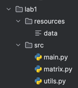
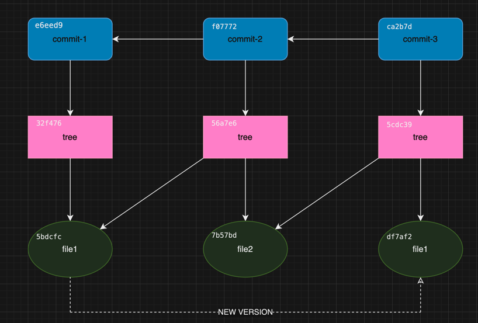

# Как git хранит данные

## Объекты

Практически вся информация, которая есть в репозитории гита хранится в виде пары ключ - значение.
Значени в git это какой-то объект, а значение - хеш-строка этого объекта по алгоритму *SHA-1*.
Объекты могут быть трёх видов:  
1. BLOB
2. Tree
3. Commit

Данные о каждом объекте сжимаются с помощью _zlib_ и записываются в файлы в директорию *.git/objects*.
В ней есть множество поддиректорий, называющихся двумя символами (например _a6_ ).
Это первые два символа хеша самого объекта. Остальные 38 символов - это название
файла этого объекта в данной директории.

### BLOB

Binary Large OBject - это бинарный файл произвольного содержимого. Git записывает в его заголовок только
размер файла, а следом идут байтики данных. Обычно именно в таком объекте хранятся файлы вашего
репозитория. BLOB объект не хранит даже название файла, для этого есть другой тип.

### Tree

Как несложно догадаться из названия этот тип объекта хранит дерево, точнее его вершину.
Этот объект содержит одну или несколько записей в строгом формате:

```
<права доступа> <тип объекта> <хеш объекта> <имя файла>
```

А вот и наше потерянное имя файла. Исходя из этой структуры, можно увидеть, что объект
дерева по фату хранит в себе список ссылок на другие объекты в виде их хешей и информацию о них.
Конечно в этом списке могут быть и другие деревья, на то оно и дерево.
Примечательно, что git имеет только четыре типа прав доступа:
- 040000 — директория
- 100644 — обычный файл
- 100755 — исполняемый файл
- 120000 — символическая ссылка

Директориями помечены как раз-таки объекты типа Tree, остальные типы прав для объектов BLOB.

#### Рассмотрим пример файловой системы



Для такого дерева файлов git может иметь следующую структуру:

<lab1-hash>:  
```
040000 tree <resources-hash> resources  
040000 tree <src-hash> src
```

<resources-hash>:  
```
100644 blob <data-hash> data  
```

<src-hash>:
```
100755 blob <main-hash> main.py
100755 blob <matrix-hash> matrix.py  
100755 blob <utils-hash> utils.py  
```

### Commit

Последний тип объекта - это конечно же всеми любимый commit. Да, коммиты это точно такие же
объекты как и файлы и директории для гита. Объект Commit содержит в себе следующие строки:
```
tree <tree-hash>
parent <parent-hash>
author <config.user.name> <config.user.email> <timestamp>
commiter <config.user.name> <config.user.email> <timestamp>

<commit-message>
```

То есть файл коммита несет следующую информацию:
- Ссылка на корневой каталог фалов репозитория данной версии
- Ссылка на родителя (у корневого коммита ее нет, а у merge коммитов может быть две и более)
- Указание автора коммита
- Указание коммитера
- Временная метка коммита
- Сообщение (название) коммита

Именно эти данные вы можете достать по хешу коммита из git log.

#### Пример структуры объектов репозитория
Произведем следующие команды в каком-нибудь системном каталоге:
```
git init
echo "version1" > file1
git add file1
git commit -m "commit-1"
echo "some text" > file2
git add file2
git commit -m "commit-2"
echo "version2" > file1
git add file1
git commit -m "commit-3"
```

~~Надеюсь, читатель хорошо понимает что мы сделали.~~  
Тогда все объекты репозитория можно представить следующим графом:



Где по стрелочкам можно перемещаться как по ссылкам из объекта на другие объекты (через их хеш
естественно). Как можете заметить, при изменении содержимого файла git создал для нас еще один объект.
Также на один и тот же файл конечно же могут вести несколько ссылок, ведь не имеет смысла
копировать все файлы без изменений в новую версию.

Кстати, так просто содержимое файла объекта не посмотришь, так как оно сжато. Git имеет
полезную команду ```git cat-file -p <hash>``` для просмотра своих файлов.

## Экономия памяти

Мы выяснили, что для объектов, которые хоть как-то изменились, git создает копию и как следствие
новый файл. Получается, если у нас есть огромный исходник в 100Mb, между коммитами мы
изменим в нем одну строчку, то придется пушить на GitHub более 100Mb? Нет. Во-первых, сам файл объекта
будет весить меньше из-за сжатия. Во-вторых, git не настолько тупой.

Да, сразу после изменения файла и добавления его в git (через ```git add```), создастся новый объект,
в котором будет всё содержимое "нового" файла. Даже после коммита, скорее всего ничего нового
не произойдет. Однако вы можете вызвать сборщик мусора гита ```git gc```. Ну или просто не
парится, ведь он сам вызывается довольно часто, например, при выполнении ```git push```.

### Pack

В описанной выше ситуации после вызова сборщика мусора вы можете заглянуть в _.git/objects_ и
с удивлением не обнаружить там ни одного объекта. Хотя коммиты, деревья и файлы в вашем репозитории
есть. Всё потому что для экономии памяти git упаковывает объекты в ***pack*** файлы.
Теперь вы можете найти два новых файла:
```
.git/objects/pack/pack-<hash>.idx
.git/objects/pack/pack-<hash>.pack
```

***.idx*** хранит индексацию файла ***.pack***. Там вы можете посмотреть хеши ваших старых объектов,
их размер, кто на кого ссылается и тд. Конечно git не просто склеил содержимые всех объектов в
один файл, иначе это не имело бы смысла. Умный git нашел среди всех наших объектов похожие
по именованию, типу, содержанию и сохранил их в виде разных версий одного и того же объекта.
Последний объект считается самым востребованным, а потому сохраняется полностью, но вместо того,
чтобы полностью сохранять и другие объекты, git оставляет только разницу между ними.
Это сильно экономит место, особенно при больших объемах одного объекта.

Также Garbage Collector умеет отслеживать объекты, на которые нет ссылок. Такие остаются,
например после ```git reset``` или ```git rebase```. Такие объекты удаляются после
определенного количества времени (можно настроить в конфиге).

## Источники информации

- <https://habr.com/ru/companies/badoo/articles/163853/> Внутреннее устройство Git: хранение данных и merge
- <https://git-scm.com/book/ru/v2/Git-изнутри-Объекты-Git> Git изнутри - Объекты Git
- <https://git-scm.com/book/ru/v2/Git-изнутри-Pack-файлы> Git изнутри - Pack-файлы
